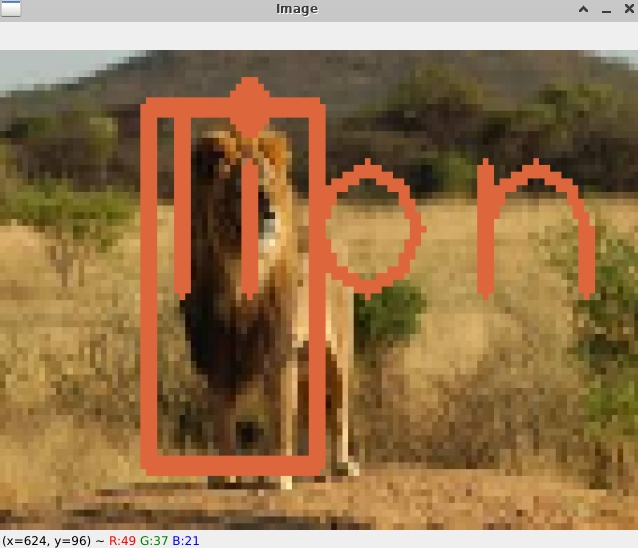
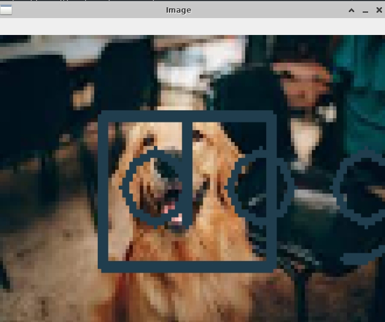
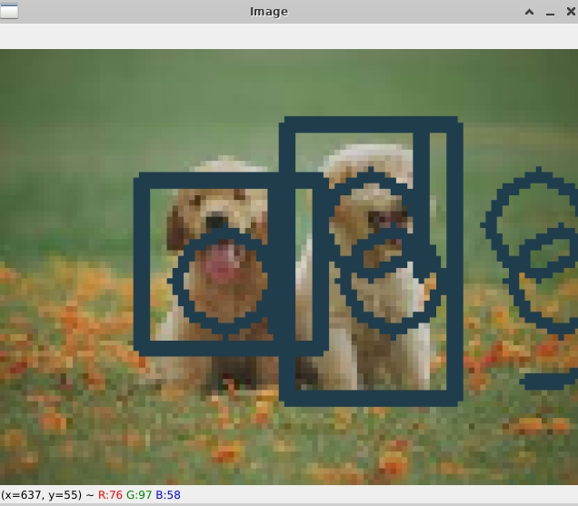

# yolov3_multiple
## yolov3 with multiple classes

## Data training and testing with yolov3

1 Creating dataset steps
Dateset creating is very easy . you can collect data from google searching via image downloader, imageassistant or etc. you can see youtube videos for that purposes then you can use labelImg program for labelImg images location for training aages and to zip this file of which contains images and text file of locations veri setini labelmg ile olusturabilirsiniz. Bunun için internette fazlaca video var. Veri seti eğitildikten sonra

2 Upload dataset
after creaition images.zip you can upload to the Google Drive and then could be use this data set via Google Colab

3 Training dataset
all that done above you can start training your dataset via colab .Firstly you must upload Train_YoloV3_.ipynb file to the Google Colab and start training . After starting training operation you can obtain yolov3_training_last.weights and yolov3_training_1000.weights(every after 1000 rounds and so 2000....)

now dataset weights easy and you can run the yolo_object_detection.py to run test proccesses.

## Results

